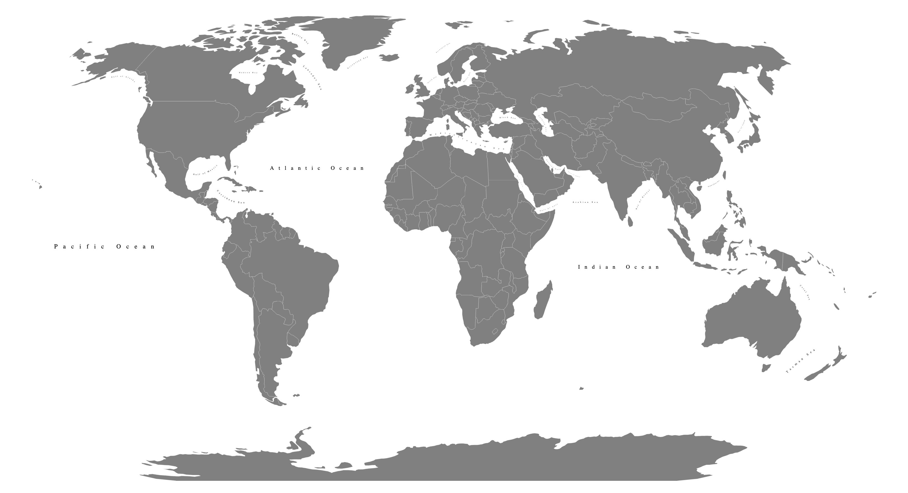

# Sea labels

A [GeoJSON collection](./data.geojson) of multilingual sea labels positioned with curved lines.

So far we support the following [languages](./modifyData/languages.json):

- Arabic
- Spanish
- Hindi
- French
- Portuguese
- Russian
- Dutch
- Chinese Traditional
- Urdu
- Indonesian
- Inuktitut [it's a facinating language](https://www.youtube.com/watch?v=xW4hI_METac&ab_channel=TomScott)
- Japanese
- Turkish
- German
- Hebrew

## Contributing

Not all the seas are yet in this collection, we only have 26 😞 But you can help by following these steps:

- Install [QGIS](https://qgis.org/en/site/forusers/download.html) (it's free)
- Install the [Bezier Editing plugin](https://plugins.qgis.org/plugins/BezierEditing/)
- Add data.geojson to your QGIS project
- Add with the line tool and the Bezier tools some seas (don't worry about the translations)
- If you want straight lines, add the country id to the `idsOfLabelsWithStraightLine` in [straightenLines.js](./modifyData/straightenLines.js) and run `node modifyData/straightenLines.js`
- If you make a pull request, I can run the translation script
- if you want to translate yourself, get an API key from [Microsoft Translator](https://azure.microsoft.com/en-gb/pricing/details/cognitive-services/translator/) (it's free) and add .env file in the `modifyData` folder with the following content: `AZURE_TRANSLATE_KEY=YOUR KEY HERE`. Navigate to `modifyData` and run `npm install && node translateLabels.js`